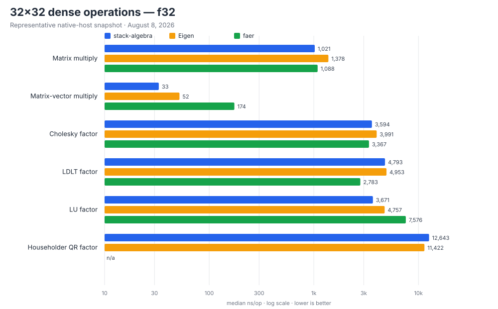
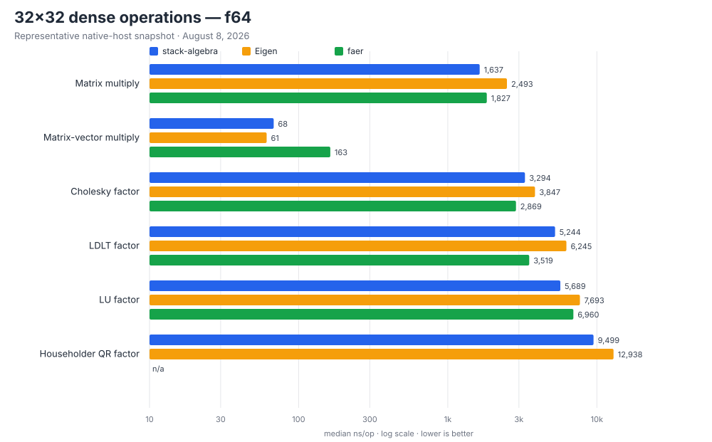
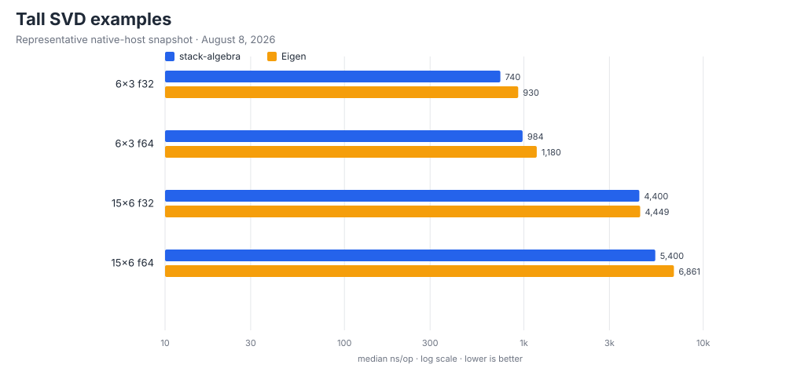

# Performance

Benchmarks are included to give a rough sense of the runtime cost of common
`stack-algebra` operations. They are most useful for orientation and regression
tracking. For decisions that matter to a product or algorithm, measure the
actual workload on the actual target.

## Accepted production improvements — September 6, 2026

The charts in this section summarize **same-runner before/after validation**
for performance changes that are now part of `main`. They show relative
improvement over the immediately preceding production implementation, not a
cross-library comparison. Experimental candidates that were rejected because
they regressed other workloads are not included.

Ranges show the spread reported across repeated hosted measurements where the
validation intentionally avoided claiming a tighter point estimate.

### Dense reusable solves


The dense chart covers reusable LDLT multi-RHS solves plus representative
D=32 lower- and upper-triangular solves. A value of `unchanged` means the
accepted implementation deliberately retained the previous fast path for that
case rather than trading it away for gains elsewhere.

### Small `f32` dot products


The dot-product chart covers AVX2/FMA lengths that were validated in repeated
hosted runs. The implementation remains generic over the vector length; the
listed sizes are measurement points, not dispatch cases.

The checked-in [source data](assets/accepted-performance.csv) includes the
merged change provenance. The SVGs are generated by
`python3 scripts/generate_docs_performance_charts.py` when the documentation is
built, so the published charts and their source data cannot drift apart.

## Representative cross-library snapshot — August 8, 2026

The charts below show representative native-host results from **August 8,
2026**. Values are median nanoseconds per operation. Lower is better. This
snapshot is intentionally dated: the accepted-change charts above are newer,
while a pinned release benchmark remains the authority for a new full
cross-library snapshot.

## 32×32 dense operations

### `f32`



### `f64`



## Tall SVD examples



## How to read the results

- Treat these as **representative measurements**, not guarantees.
- Matrix shape, scalar type, compiler flags, target features, memory placement,
  and machine load can materially change timings.
- The accepted-change charts report relative before/after improvements from
  same-runner validation; the cross-library charts report absolute latency.
- The logarithmic horizontal axis on the cross-library charts is used so both
  very small and much larger operations remain visible on the same chart.
- Missing bars indicate that a result was not included in that snapshot.

## Matching the measured phase matters

Benchmark interpretation depends on what is being timed.

For dense solvers, **factor-and-solve** includes factorization, while a
**reusable-factor solve** measures only the solve using an already-built factor.
Those answer different application questions.

For sparse systems, symbolic analysis, numeric assembly, factorization,
refactorization, permutation/setup, and solve are measured separately where
applicable. Keeping those phases distinct makes it easier to map the benchmark
to a real application loop.

## Nightly measurements

The repository runs a nightly benchmark workflow covering selected dense,
sparse, and block-sparse operations. The workflow publishes a
`nightly-benchmark-report` artifact containing:

- a self-contained HTML report;
- CSV measurements;
- raw benchmark inputs;
- commit, runner, CPU, compiler, and generation metadata.

Open the [nightly benchmark workflow](https://github.com/yongkyuns/stack-algebra/actions/workflows/nightly-bench.yml),
choose a completed run, and download the `nightly-benchmark-report` artifact for
fresh measurements.

Nightly uses relatively short measurement windows so it can cover a broad set
of cases regularly. For a release or architecture decision, run the relevant
case for longer on the hardware that actually matters to the application.

## Running focused benchmarks locally

For fixed-size dense operations:

```sh
RUSTFLAGS="-C target-cpu=native" cargo bench --bench comparison
```

For embedded work, host microbenchmarks are only a first check. The most useful
measurement is the complete operation on the target MCU or processor with the
same scalar type, dimensions, compiler flags, and memory placement used by the
application.
